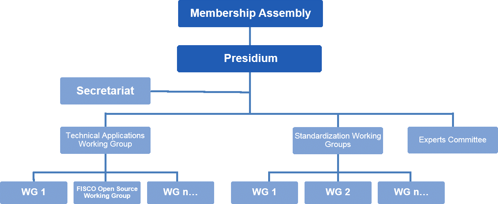
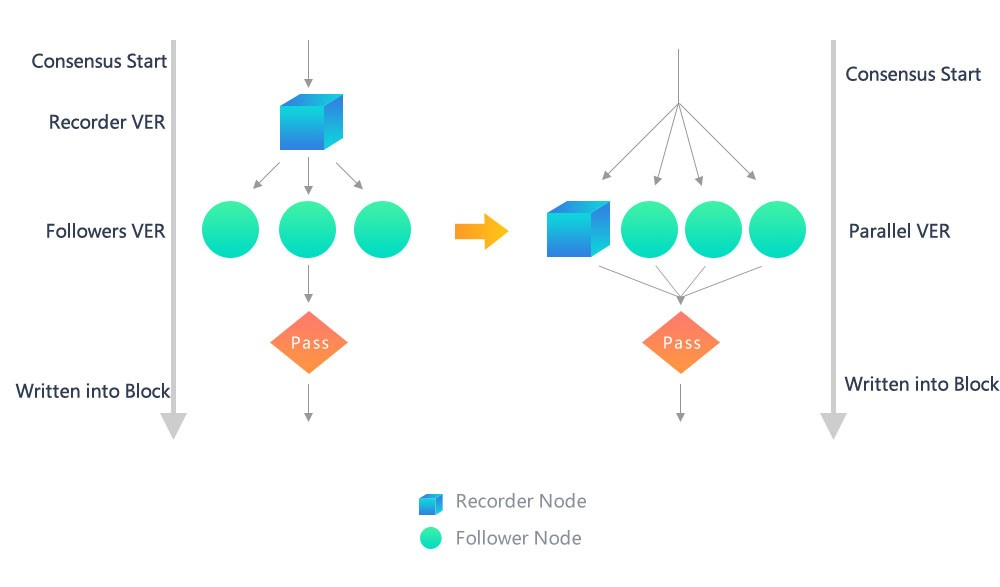
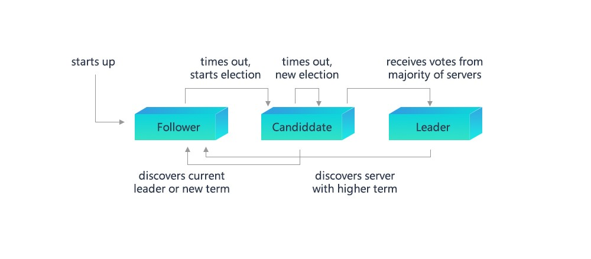
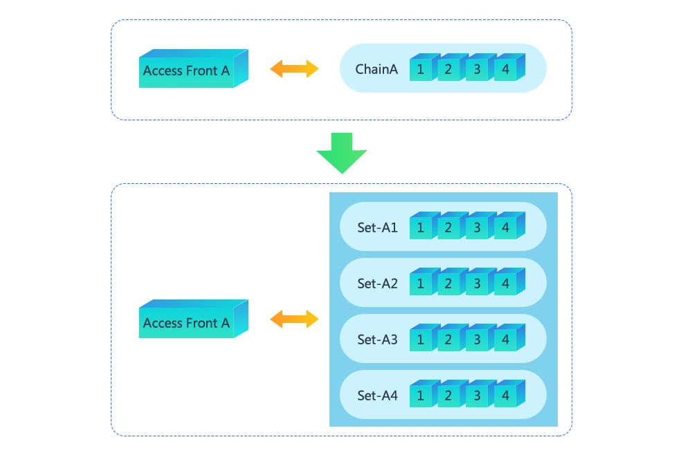
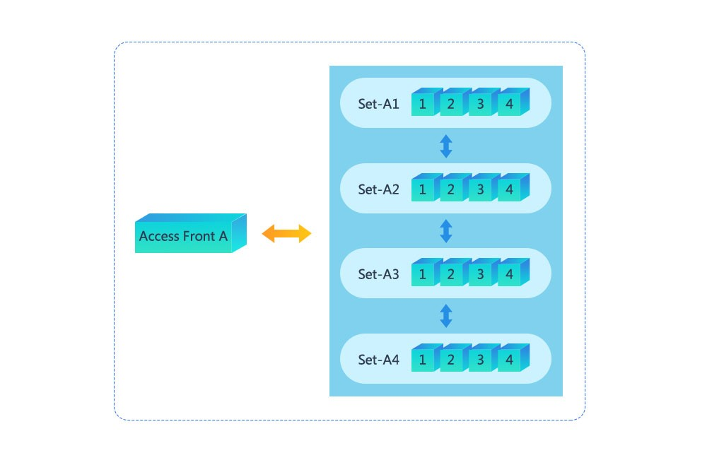
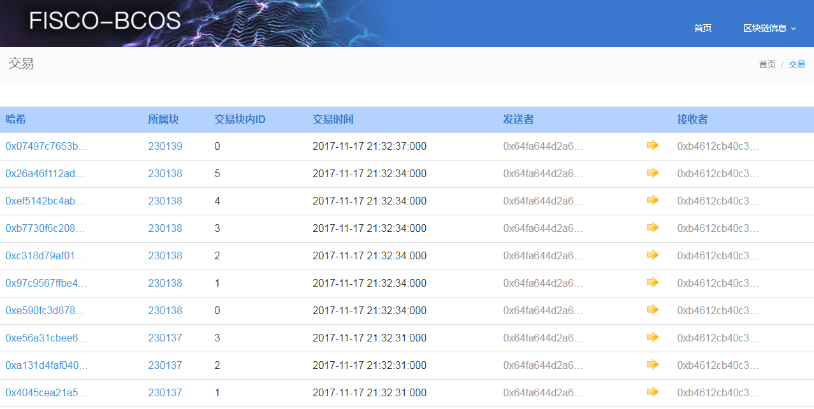

# 
Financial Blockchain Open Source Platform FISCO BCOS Whitepaper

## 
Financial Blockchain Infrastructure & Practical Examples

### 
v1.0
  

#### 

### 
**Github**:[Https://github.com/fisco-bcos](Https://github.com/fisco-bcos)

### 
December 2017

<!-- TOC -->

## Table of Contents
- [Introduction](#Introduction)
- [1 Blockchain Alliance – Vision and Main Objectives](#1-BlockchainAlliance–VisionandMainObjectives)
    - [1.1 About FISCO and FISCO Open Source Working Group](#11-AboutFISCOandFISCOOpenSourceWorkingGroup)
    - [1.2 Introduction of the First Batch of Members of the FISCO Working Group](#12-IntroductionoftheFirstBatchofMembersoftheFISCOWorkingGroup)
    - [1.3 Mission of the FISCO Open Source Working Group](#13-MissionoftheFISCOOpenSourceWorkingGroup)
- [2 Lessons Learned – Pain Points and Solutions](#2-LessonsLearned–PainPointsandSolutions)
    - [2.1 Pain Points of IT Infrastructure in the Traditional Financial Industry](#21-PainPointsofITInfrastructureintheTraditionalFinancialIndustry)
    - [2.2 Blockchain: Solution for the Special Needs of the Finance Industry](#22-BlockchainSolutionfortheSpecialNeedsoftheFinanceIndustry)
    - [2.3 Application Scenarios of “Blockchain + Finance”](#23-ApplicationScenariosof“Blockchain+Finance”)
- [3 Advancements: Restructuring Modules & Rebuilding Capabilities](#3-AdvancementsRestructuringModules&RebuildingCapabilities)
    - [3.1 Interoperability Improvements – Advanced Messenger On-chain Protocol (AMOP)](#31-InteroperabilityImprovements–AdvancedMessengerOn-chainProtocol(AMOP))
    - [3.2 Operation Maintenance Capability Improvements – Contract Naming Service (CNS)](#32-OperationMaintenanceCapabilityImprovements–ContractNamingService(CNS))
    - [3.3 Financial Grade Performance Improvements – Parallel Consensus and Parallel Computation](#33-FinancialGradePerformanceImprovements–ParallelConsensusandParallelComputation)
        - [3.3.1 Parallel PBFT Consensus](#331-ParallelPBFTConsensus)
        - [3.3.2 Standard RAFT Consensus Algorithm](#332-StandardRAFTConsensusAlgorithm)
        - [3.3.3 Parallel Computing Solutions for  High Frequency Accounts](#333-ParallelComputingSolutionsforHighFrequencyAccounts)
    - [3.4 Governance Capability Improvements – Browser and Control](#34-GovernanceCapabilityImprovements–BrowserandControl)
    - [3.5 Blockchain and RegTech](#35-BlockchainandRegTech)
        - [3.5.1 Risk Data Integration](#351-RiskDataIntegration)
        - [3.5.2 Risk Modelling, Analysis and Prediction](#352-RiskModelling,AnalysisandPrediction)
        - [3.5.3 Real-time Transaction Monitoring, Reporting and Interception](#353-Real-timeTransactionMonitoring,ReportingandInterception)
        - [3.5.4 Identity Authentication](#354-IdentityAuthentication)
- [4 Future Expectations](#4-FutureExpectations)
    - [4.1 Blockchain Cloud Service](#41-BlockchainCloudService)
    - [4.2 Support of Multiple CA Authentication](#42-SupportofMultipleCAAuthentication)
    - [4.3 Blockchain Data Warehouse](#43-BlockchainDataWarehouse)
    - [4.4 Open Source Operations](#44-OpenSourceOperations)
- [References](#References)
- [About Us](#AboutUs)

<!-- /TOC -->

## Introduction   

In the wake of the digital economy and the widespread adoption of distributed business models, blockchain technology has provided numerous benefits, becoming one of the most popular cutting-edge technologies. In 2016, three companies, including WeBank (a member of Financial Blockchain Shenzhen Consortium), Wanxiang Blockchain (a member of Chinaledger) and JUZIX, formed a strategic partnership to explore and develop blockchain technology. In July 2017, the three companies successfully created the blockchain development platform "BCOS" (Be Credible, Open & Secure) and released it as an open source project. This leverages the developer community to optimize the technology and helps to build a blockchain ecosystem. 

The BCOS platform has been available in open source for almost a year and has met positive feedback from the industry. New companies and independent developers are continually joining the consortium and helping to improve the platform. As the technology evolves and the number of use cases increases, there is also growing demand for blockchain development from many vertical industries, especially financial services.

The financial industry plays a critical role in the allocation of global funds and capital and serves as one of the supporting pillars of the national economy. The People’s Bank of China (PBOC) and other regulatory agencies have repeatedly emphasized that financial innovation should not deviate from the needs of China’s real economy. We understand that the financial industry has a unique influence on other industries and its own social characteristics. The BCOS platform faces a challenge in both meeting the special requirements of financial use cases while remaining widely applicable to all industries, a dilemma recognized by many financial institutions using BCOS.    

Because of these constraints and requirements, the Financial Blockchain Shenzhen Consortium ("FISCO") formed an open source working group, aimed at coordinating and consolidating the efforts and resources from member financial institutions and technology companies. This working group customized a secure and controllable version of the BCOS platform, called FISCO BCOS, using financial and business best practices as references.    

This whitepaper looks at the implementation of the FISCO BCOS platform and may serve as a reference in guiding its future development.  

## 1 Blockchain Alliance – Vision and Main Objectives  

### 1.1 About FISCO and FISCO Open Source Working Group  

FISCO is a nonprofit organization jointly established on May 31, 2016 by over 20 financial institutions and financial information service companies, which include among others, the Shenzhen Financial Technology Association, WeBank and Shenzhen Securities Communications. As an open organization, FISCO offers membership to any financial institutions or financial information service companies that agree to abide by the Consortium’s rules. FISCO has already admitted over 80 members from 6 financial sectors including banking, fund management, securities brokerage, insurance, regional equity exchanges, and financial information service companies.  

FISCO strives to integrate and coordinate research resources to further the development of financial blockchain technology, as well as promote collaboration and create synergies in the research of blockchain-based financial applications. Based on these objectives, FISCO acts to coordinate member companies’ R&D capabilities in applying consortium blockchain technologies to various business scenarios.

In order to explore the customization of an open source blockchain platform suitable for the financial industry, FISCO set up an open source working group under its technology committee in November 2017. The vision of the working group is to use open source technology as a medium to facilitate member cooperation, to promote the development of blockchain applications across the financial industry, and to provide technical training on the use of financial blockchain. Additionally, this group aims to further align its member organizations with various international open source institutions. Finally, the group seeks to support the financial blockchain community in fostering a diverse blockchain ecosystem, complete with many open source blockchain projects. 

The FISCO open source working group is in direct association with FISCO and abides by FISCO’s constitution, regulations, policies and other applicable rules. The members of the working group must be FISCO members.

Diagram 1-1 FISCO Organization Chart

### 1.2 Introduction of the First Batch of Members of the FISCO Working Group  

The FISCO working group is led by some of FISCO’s most prominent members, which specialize in the R&D of blockchain technology, and is widely acceptance by the entire organization. Among the working group’s initial members are the following institutions (listed in alphabetical order):
1)	Beyondsoft – Beyondsoft Technology Co. Ltd. (abbreviated as “Beyondsoft Technology”, Shenzhen Stock Exchange listed, 002649) is a global IT Consulting, Solutions and Services provider.  Founded in 1995 and headquartered in Beijing, China, Beyondsoft has over 30 nationwide offices, R&D hubs and delivery centers, as well as facilities in United States, Japan, India, Canada and Singapore.  Relying on its strong R&D heritage and ability to innovate, Beyondsoft is now focusing on using emerging and disruptive technologies, such as cloud, mobile technologies, big data and advanced analytics, to provide powerful solutions and products for clients in a wide range of industries including: high-tech, eCommerce, finance, automobiles, retail, logistics, energy, manufacturing, healthcare, telecommunications, media & entertainment, and travel.
2)	Huawei – Huawei is a global leading Information and Communication Technology (ICT) solutions provider, which is renowned for its strong operations, innovations in sustainability, and open and collaborative environment. One of its main strengths rests in its ability to provide end-to-end solutions for telecommunications, enterprises, endusers and cloud computing, etc. Currently, Huawei has more than 170,000 employees and is present in more than 170 countries and regions, serving over one-third of the world’s population. 
3)	SSCC – Shenzhen Securities Communications Co. Ltd (formerly known as Shenzhen Securities Satellite Communications Co. Ltd) was founded in August 1999 and is an advanced technology company that provides data communication services for securities markets. The shareholders include the Shenzhen Stock Exchange, China Academy of Space Technology and China Satellite Communication Group Corporation. Since its establishment, it has accumulated an immense amount of experience and expertise in research and development, creation, and operation maintenance and management of securities communication systems. Now, it is charged with building the Shenzhen securities communication network, which provides nation-wide coverage and offers highly efficient and powerful functionalities. It also handles various securities communications between the Shenzhen Stock Exchange, China Securities Depository and Clearing Co., securities companies, fund management companies, commercial banks and securities information service companies. Its customers work in fields such as securities issuing, trading, account opening, settlement, market price publishing, securities and bank networking, multi-media information transmission, etc.
4)	Digital China – Digital China Holdings Information Service Limited is a subsidiary of Digital China Holdings Limited (“DCITS”; stock code: 000555.SZ). DCITS focuses on the financial industry and helps banks in planning, implementing and managing their IT systems. It also provides fully integrated financial IT services. DCITS’s business spans IT planning consultancy, solution design and implementation, IT operation outsourcing, and software development and testing. DCITS has been known to provide industry-best IT support for banking customers in business strategy, market exploration, and service innovation and performance.
5)	Forms Syntron – Forms Syntron is an enterprise established in 2003 that services large-scale commercial banks and strives to provide the best IT outsourcing services for banks in the Greater China region. Forms Syntron’s offered services include software development with IT consulting, application maintenance, and system integration.
6)	Tencent – Tencent was founded in November 1998 and is currently one of the leading providers of Internet value-added services in China. Since its inception, and for more than 10 years, Tencent has maintained a steady growth under its user-oriented operating strategies. On June 16, 2004, Tencent Holding Limited (SEHK 700) went public through an IPO on the main board of the Hong Kong Stock Exchange. 
7)	WeBank – Established as a Tencent-led venture, WeBank is both China’s first Internet bank and first privately-owned bank. WeBank is also one of the early pioneers and founders of financial blockchain technology in China and the main developer of the original BCOS platform.  
8)	Yuexiu FinTech – Guangzhou Yuexiu Financial Holdings (“Yuexiu Fintech”) is the third fully owned subsidiary of Guangzhou Yuexiu Financial Holdings Ltd. Yuexiu FinTech focuses on core banking business systems and provides information system construction for banking, securities, financial leasing, asset investment, warranty and small-sum lending. An IT company at its core, it has set up an independent IT platform that is used as the technology management system of Yuexiu Financial Holdings. 

### 1.3 Mission of the FISCO Open Source Working Group  

The FISCO open source working group’s activities focus on helping FISCO in promoting financial blockchain open source technology. The group acts as an intermediary for communication and cooperation in the open source blockchain community, including between FISCO and other financial institutions, technology enterprises, open source communities, regulators, and international organizations. 

As such, the working group’s primary mission is to achieve the following: (1) the construction and optimization of the FISCO BCOS platform; (2) the development of the FISCO open source community through specifying work procedures and management mechanisms, establishing major development strategies and an operating philosophy, and providing supervision guidance pertaining to critical issues in the community; (3) the support and assistance for work and projects in the open source community, including, but not limited to, the publication of open source versions of financial blockchain platforms, technical training, consulting, infrastructure support, operational support and marketing. 

## 2 Lessons Learned – Pain Points and Solutions

The financial services industry has seen many of the new use cases of blockchain. Blockchain technology offers many improvements including, among other things, enhanced security and reliability, simplified workflow, cost savings, reduced operational risks and increased trust. It also holds the potential to reconstruct and optimize financial infrastructure. In the financial industry, however, institutions face heavy regulation and require advanced security, which in the context of blockchain, often necessitates a need for detailed access controls and an authorization management of nodes. Therefore, established financial institutions tend to use consortium blockchains, which more easily meet their technical requirements.

### 2.1 Pain Points of IT Infrastructure in the Traditional Financial Industry

During a time when China’s financial industry is opening to the outside world more than ever before, the pace of financial innovation is also accelerating. As a result, balancing this process of opening-up and new innovation with risk prevention and the defense against systemic risks remains a pressing challenge that the industry needs to address. 

From a financial IT infrastructure perspective, there are deficiencies and pain points relating to operational risks, moral hazards, credit risks, and information protection risks. Some of the existing, common pain points include the following:

1.  Data in the financial IT system faces risks such as being tampered with, lost, falsified or inconsistent.

2.  Inconsistent infrastructure architectures and corresponding business workflows across financial institutions result in an over-reliance on manual processing, which greatly increases operating costs and creates operational risks and moral hazards. 

3.  Trust-related costs and dispute resolution costs in multi-party collaborations in the financial industry can be prohibitively high. As the number of parties increases, issues regarding mutual trust as well as interparty cooperation and coordination arise. 

  4.Due to the complexity of financial procedures, there tends to be negligence in full record keeping. Sometimes it is impossible to trace back a business process flow, failing to meet compliance requirements of regulators and auditors.

  5.Data of different institutions are relatively isolated, and it is difficult and costly to set up a secure and efficient data exchange between them. This results in greater overall costs due to repeated KYC, anti-money laundering, and fraud screening processes. Additionally, this can indirectly bear new risks, such as user data leaks via the intermediaries that often perform these screenings.

  6.The functionality and adaptability of centralized IT infrastructure are relatively weak. In contrast, distributed technology enhances system robustness and adaptability.

### 2.2 Blockchain: Solution for the Special Needs of the Finance Industry 

As a modular infrastructure solution, blockchain technology is, in principle, able to meet all the demands of the finance industry. However, due to the finance industry’s myriad and stringent requirements, the financial version of a blockchain solution should consider factors specific to financial institutions, including financial institutions’ existing IT infrastructure and compliance with regulatory requirements. Moreover, the implementation of such solutions needs to be comprehensively assessed from a multi-dimensional viewpoint, including but not limited to the following considerations: business suitability, performance, security, existing policies, technical feasibility, operations and maintenance, cost, etc.

First, since not all financial industry use cases benefit from blockchain technology, a first step to consider is the suitability of using it. In scenarios that involve multiple participants with peer cooperation, a traditional, centralized system framework may not satisfy the requirements. In this case, blockchain technology can increase mutual trust, enhance operational efficiency and reduce operational and dispute costs.  

Second, one must consider the performance of a blockchain system. Inherent to the financial industry are high-volume, high-frequency transactions that require instant or near-instant confirmation. As such, financial institutions must make their decision of how and if to use an open-source financial blockchain platform based on a thorough analysis of the expected technical requirements, such as future business volume, scale of potential business growth, concurrent business volume, response time, etc. Furthermore, blockchain platforms using different consensus mechanisms vary largely in how each supports system performance. Due to the adoption of different technology modules, there is a need to use a common set of blockchain efficiency indicators when evaluating a blockchain performance in meeting certain business requirements.

Third, is the security of a blockchain platform.  Blockchain technology helps guarantee data credibility by preventing the risk of data tampering and fraud. Apart from data sensitivity and safety, it is essential to evaluate the required strength of data encryption and the authorization of access control among other parameters. It is recommended that financial institutions choose a mature and safe encryption algorithm that meets the specific safety requirements of their business and infrastructure. 

Fourth, is compliance. Blockchain is a set of technical solutions, and with the proper design, it can support existing businesses and supplement centralized systems. It should be noted, however, that when using blockchain technology, financial institutions must comply with existing regulatory requirements and legal frameworks. 

Fifth, is technical feasibility. Currently, blockchain technology is already being applied to a variety of business scenarios, but for now, it is still an emerging technology. There is a need to thoroughly evaluate if this technology is appropriate for specific business needs and even then, it must be compared against other more traditional solutions. If both suitable and more effective, then an appropriate blockchain platform can be chosen for proof of concept.

Sixth, is operations maintenance and governance. Because blockchain technology and traditional centralized system are different when it comes to their operations and management, and because the requirements for a sustainable governance in the financial industry are quite complex, an in-depth analysis is critical. More specifically, assessing the feasibility and sustainability of the new governance structure, measuring the impact of a version upgrade and the launch of the production system, and monitoring the platform in real-time to ensure that operations are controllable and the financial environment is stable.   

Last, is cost control and economic feasibility. Blockchain technology applications solve many specific operational problems with its own technical characteristics. This can effectively bring about benefits for the financial industry, and as such, the potential of the technology becomes apparent. However, critical operational issues can persist, in which case a detailed cost-benefit analysis may help to assess whether the implementation is worth its cost. 

### 2.3	Application Scenarios of “Blockchain + Finance”

If a set of secure and reliable blockchain platforms can be developed with a strong focus on the specific requirements of the financial industry, then blockchain technology will bring benefits to the whole industry. 

For example, from most banks’ point of view, blockchain technology is often seen as a means to lower clearing and settlement costs, improve middle- and back-office operational efficiency, enhance the degree of workflow automation, lower operational costs, etc. In cross-border financial transactions, blockchain can be used to create a public ledger between financial institutions, thus lowering the cost of reconciliation, clearing and settlement, as well as the dispute cost between cooperating banks.

From a non-financial institution’s point of view, blockchain can be utilized to improve the credibility of equity registration and information records, reduce transaction risk between counterparts, solve data tracking issues, prevent information fraud, lower the operational cost of audits, etc.   

From financial regulators’ point of view, blockchain provides consistent data that is easy to audit and analyze, making the process much faster than a traditional audit. For instance, in the case of anti-money laundering, the balance and transaction records of each account are traceable. As such, blockchain technology enforces anti-money laundering strength. 

## 3 Advancements: Restructuring Modules & Rebuilding Capabilities 

To gather and promote best practices in the financial industry, the FISCO open source working group decided to use the BCOS Open Source Platform as a base for constructing a financial blockchain. After going through an extensive review of business requirements, the group has incrementally added modular upgrades, and redesigned and optimized many functions. The result is the FISCO BCOS platform, with new functionalities, features and capabilities – tailored to better serve the needs of financial institutions.

### 3.1 Interoperability Improvements – Advanced Messenger On-chain Protocol (AMOP)  

Based on the blockchain system, an inter-communication network can be set up between institutions. The consensus mechanism of the blockchain and block data exchange are already implemented in transactions between institutions. However, as business scenarios become more sophisticated, interoperability requirements too increase. 

When institutions interact, the process is not as simple as merely sending transactional data from one point to another. Challenges occur due to a need to issue real-time receipts between the parties, or due to a need to exchange information between the involved institutions, or due to a need to hold rounds of pricing negotiations before transactions can be further processed. In all the above cases, the institutions do not want to broadcast their transactional information to the entire network. As such, a portion of the information is usually omitted from the transactional blocks. Traditionally, institutions often provide dedicated network or an agent system to communicate with other institutions. Today, however, blockchain can provide a steady, reliable, and highly efficient network. Hence, it is possible reuse the blockchain network to complete the communication.

To facilitate such communication, we have designed a high performance, reliable, blockchain-based messaging communication protocol, Advanced Messenger On-Chain Protocol (AMOP), which provides the following features: 

•  Uses blockchain network to support inter-branch, peer-to-peer， real-time message communication; 

•  Blockchain system actively invokes the operation API of the off-chain system;

•  Provides standardized API for the interaction between off-chain systems and the blockchain.

The technical features of this protocol include the following:

•  Peer-to-peer network topology: the communication path of the network nodes is planned to ensure that the messages are deliverable;

•  Rapid detection of node abnormalities in the blockchain network and automated path switching to resend messages;

•  Encryption technology used in the communication process to ensure the confidentiality of the communication layer.

")

Diagram 3-1 Architecture of AMOP (Advanced Messenger On-chain Protocol)

In the business interactions between financial institutions, the AMOP protocol can provide flexibility and interoperability, and can also be seamlessly integrated within a blockchain network to execute even complicated transactional scenarios. Let us consider the following situation:

Institution A and Institution B are negotiating a price for a transaction. Information needs to be repeatedly sent back and forth before the transaction can proceed. After reaching a mutual agreement, they initiate the transaction on the blockchain, after which a record will be made on in the ledger and the transaction signaled complete with a confirmation.

During the initial phase of the transaction is the negotiation; there is a high demand for real-time response at this stage, usually measured in milliseconds. This process does not involve any of the other institutions on the blockchain, nor should any other party know about the transaction details. The AMOP protocol can be used to assist in processing confidential peer-to-peer communications. This protocol ensures that no network packets will be transferred to the nodes of other institutions and ensures the physical isolation of the communicating parties.

Another scenario would be a company that places a purchase order on the blockchain network with the hope of receiving a fast response. The receiving institution then performs tasks off the blockchain network, such as inventory verification and stock preparation. The AMOP protocol can be used to inform the ordering party when these off-chain activities begin and finish, before the parties return to the blockchain to continue the subsequent backend workflow to complete the order, such as completing payment.

In addition to its specialized features in facilitating secure communication across a blockchain network, AMOP can also be deployed as a messaging channel for open communications between blockchain networks to exchange blocks and transaction data. 

### 3.2 Operation Maintenance Capability Improvements – Contract Naming Service (CNS)

Currently, the fundamental information of users, accounts, smart contracts, etc., of the blockchain is recognized as an “address”. These addresses are usually denominated as a fixed length series of hexadecimal values. When the business layer needs to use these addresses, it will record them in a database, as configuration files, or some other means. However, these hexadecimal addresses are hard to identify by data type and corresponding data use case, as well as hard to memorize, write down and reuse.

For instance, when the business layer invokes a ledger contract, it needs to configure an address like “0x92535066cd4b022c7e84b058d8bbbf71e22c3c78”. In daily operations and configurations, when the need arises to reuse this ledger contract, the business layer needs to confirm that this number segment is complete and correct in order to invoke the contract API correctly. Other usages that would require this address include, but are not limited to, operational investigation (during which the address is used to query the corresponding messages in the logs) and service expansion (during which the address needs to be set up in the configuration file).

Because of the possible changes in the business logic that could arise in this ledger contract after upgrades or a redeployment, all the business modules that previously referenced this contract address may need to be modified one by one in order to point to the new address of the contract. This whole process is complex and error-prone.

As such, we have designed the Contract Naming Service (CNS). The design goal of the CNS is to provide names for the corresponding relationship between the business layer and specific smart contracts. This allows the business layer to disregard the exact address of a specific corresponding contract. The inspiration for the design of the CNS comes from the DNS on the Internet and it enhances the management of the contract portal information. Just as the use of domain name allows users to easily memorize the hyperlink of a website and gives the website a great flexibility in terms of clustering, migration and capacity expansion, the CNS also provides the contract with the possibility to publish its portal information to the blockchain and allows all participants on the blockchain to conveniently identify, locate and invoke a contract.

During the deployment of smart contracts, the CNS allows the party that deploys a specific contract to assign an easily memorable and identifiable name to the smart contract, e.g. “Deposit Contract” which would obviously point toward a deposit contract. The business layer only needs to know this name to invoke a transaction involving the deposit contract. The CNS confirms the corresponding address of the contract name before processing the transaction and then runs the contract. 

If the deposit contract is upgraded, the address of the new version of the contract is also updated on the CNS, provided that it is the original portal being modified. The business layer does not need to change its configuration and would not observe any change, avoiding an otherwise heavy workload tied to the address update, and greatly reducing the probability of errors in the process.

If the API need to be modified, or major business logic changes do appear however, the business needs to proceed through a canary release. In the CNS, the two respective addresses of the old and the new contract can be retained. Depending on the specific canary release plan, a portion of the transactions will be directed to the new contract by either the business layer or the CNS combining various routing rules. When the logic of the new contract becomes sufficiently stable or the canary release has reached 100%, the calling of the old contract will then be entirely substituted for the calling of the new contract.  

It is important to remember that a canary release operation is a complicated process and the rules of canary release vary across industries and disciplines. The CNS provides all the required fundamental capabilities at the platform level while staying flexible. Use of these tools still needs to be thoroughly reviewed and carefully planned according to the unique circumstances. For instance, implementation of routing rules during the canary release is an important consideration. In this respect, the platform gives the discretion to users to freely develop new features based on FISCO BCOS.

### 3.3 Financial Grade Performance Improvements – Parallel Consensus and Parallel Computation

#### 3.3.1 Parallel PBFT Consensus

The PBFT Consensus mechanism of BCOS is already focused on allowing the customization of consortium blockchains to achieve block creation within seconds with high consistency, high functionality and strong anti-fraud features.

The PBFT algorithm mechanism consists of a one-time proposal and multiple voting steps leading to the final confirmation. During this process, there are complicated mechanisms that aim to maintain the state machine, which involves numerous back and forth voting steps. Moreover, part of the processes occurring inside the nodes and between the nodes are linear. Each step requires mutual agreement between the nodes and only after the completion of all computations and confirmations shall the next phase begin. 

Because the workflow is complex and there is a back and forth of data transmission, the consensus process can be easily influenced by network fluctuations and is very sensitive to network latency and packet loss. On a sub-standard network and computing environment, it may take several rounds of consensus processing before eventually achieving consistency.

As the above technical issues affect the system, the system parallel capability may experience a bottleneck or the confirmation speed of transactions may be severely delayed at times. As such, FISCO BCOS optimizes the PBFT algorithm to adjust accordingly. 

We first conducted an in-depth analysis of the consensus process of the FISCO BCOS platform and distilled its various components, such as calculation steps, nodes, etc. The guiding objective was to run the calculation of all nodes at each phase in parallel, irrespective of whether or not a node was a leader node or a voting node. When one node is computing to verify a batch of transactions, all other nodes are also synchronized to compute and vote on it without waiting for the others. 

Diagram 3-2 Parallel PBFT Consensus Procedures
  

Building from this, we have been able to further reduce time-consuming and redundant computing processes. Through network path optimization and caching of repeated computing results, the time required to complete each step of the consensus process is minimized.   

We also investigated factors that could influence network health and the node survival. For example, when any ledger node is found to have failed, the algorithm quickly switches to another ledger node, so as to avoid keeping all the nodes waiting.

Finally, we took into consideration the characteristics of many financial transaction conditions and recognized that financial activity often results in peak hours and idle periods. During idle periods when the system has no transaction flow, the consensus mechanism enters into a heartbeat state. It keeps a minimum state on the network and does not generate blocks with transactional data of ‘0’ so as to avoid wasting storage space and to save subsequent synchronization transmission and time.

#### 3.3.2 Standard RAFT Consensus Algorithm

The implementation of BCOS’s RAFT consensus algorithm borrows from the Standard RAFT protocol, but with some notable differences. For example, every time the block creation time window expires, all nodes enter a competition again to acquire the rights to create blocks.

Considering that the Standard RAFT protocol is not Byzantine fault-tolerant, it is recommended to implement it only in a highly trusted Consortium Blockchain. However, in order to take advantage of the high-performance advantages of RAFT protocol, we have adjusted the RAFT consensus algorithm for FISCO BCOS to adopt the consensus algorithm of the standard RAFT protocol.

The standard RAFT consensus algorithm has two steps: the first is the “election” process that chooses a leader, and the second is the “ledger keeping” process where the leader is responsible for ledger keeping and block creation and the other follower nodes create the blocks simultaneously. When the leader is down, all the¬¬¬ follower nodes initiate the election workflow to elect another leader again. 

Diagram3-3 Procedures of Standard RAFT Consensus Algorithm
  

Additionally, we further modified the RAFT algorithm mentioned above to optimize against abnormal scenarios such as network jitter, network latency and network partition. These efforts aim at making the RAFT consensus algorithm usable in less favorable network environments. BCOS RAFT consensus algorithm possesses an “N/2 level” fault tolerance capability, meaning that only half of the nodes are needed to provide a normal level of service.    

To endow consortium blockchain networks with greater scalability, the BCOS RAFT consensus algorithm can also be combined with smart contracts to support dynamic node entries and exits from the network, another distinguishing feature that sets it apart from the standard RAFT algorithm.    

#### 3.3.3 Parallel Computing Solutions for  High Frequency Accounts

During the research and implementation phase and the process of operational deployment, we noticed that the running speed of the blockchain is always affected by various factors. These factors usually include encryption/decryption computation, transaction broadcasting and ordering, collaborative overhead of the consensus algorithm with multi-phase submission, execution speed of virtual machines, number and speed of CPU cores, disk I/O capabilities and network bandwidth. Blockchain is born with a cross-network and distributed collaboration system, with a focus on security, availability, fault tolerance, consistency and operations. It also uses complex algorithms and multi-party cooperation mechanisms to provide functional advantages of trust, data consistency and transaction traceability. Therefore, according to the distributed CAP principles, with the same hardware resources, the performance of blockchain is in most cases lower than that of a centralized system. This can be seen in the form of a low number of parallel running processes and noticeable latency in transactions. 

We have already solved some of these problems by optimizing every detail of system operations across the entire workflow. This includes changes to encryption/decryption computation, transaction handling workflow, the consensus algorithm, and storage, among others. Thanks to these changes, our blockchain platform, even under a single-chain structure, can achieve high performance, allowing it to meet the typical needs of most financial activities.    

However, when facing extreme situations that involve massive user bases, high transaction volumes, huge amounts of data being stored, or significant growth in the number of services, which requires a system with larger storage and wider scalability, the single-chain structure might encounter a bottleneck caused by the software framework or hardware resources.

Moreover, depending on the system characteristics of the blockchain, the addition of nodes in a blockchain network increases the system tolerance and credibility of participant endorsements. However, it will not increase the blockchain’s overall performance. To remove performance limits, we propose a combination of parallel computing and adopting multi-chain operations.

The concept of adopting parallel computing and a multi-chain operation comes from the idea that there are multiple groups inside a blockchain network. These groups form complete blockchain networks, with each group having independent software modules, hardware resources. Each group is also able to independently complete the consensus process between institutions and has an independent data storage infrastructure.

Depending on the routing rules configuration, all institutions and individual users of a blockchain network, as well as different types of transactions, can be assigned to different groups within the network for processing. Each group handles a particular portion of the transactions. When the number of the institutions or users increases, the transaction volume and the transaction types increase as well. More processing groups can be flexibly added to the network to adjust. Routing rules can be amended to direct the increased workflow into the newly added groups. The parallel computing and multi-chain framework is similar to database sharding, or the SET model of Internet services. Theoretically, as long as there are sufficient groups, there is no upper limit on the transaction volume, enabling a system of unlimited scalability.

At the same time, groups in the blockchain networks all share consistent logic and the same principles for business guidelines and operation management. For example, the smart contracts in each group and the core configurations are identical across all groups. Only the institutions, users and transaction types in each group are different.

Different groups can be configured with different capabilities, however, leading to completely different smart contracts across groups. For example, some groups process online transactions, while others handle reconciliation and clearing between institutions. As such, the smart contracts implemented in these two types of groups are different. Nevertheless, the different smart contracts are endorsed by all members and the blockchain network’s operation committee to guarantee that the implementation is consistent, transparent and tamper-proof via a consensus algorithm.

The platform therefore provides a foundation for the strategy and implementation of ‘sharding’ and the tools for constructing routing modules and the parallel computing and multi-chain framework. Each of these can be deployed to assign different groups to handle different business scenarios. For example, some of the most common means used to define groups include the following parameters: institution, user, transaction, and even time. This makes the platform flexible enough to suit the needs of various operational designs.

Diagram3-4 Parallel Computing in Multi-Chain Framework

After dividing a blockchain into many groups, any number of different transaction scenarios may exchange between the different groups. In practice, these are communication and transaction exchanges between different blockchain systems, and exhibit qualities somewhat akin to a “cross-chain” structure. With regards to this type connectivity, what is important to note is the reliability of inter-group communications, the completeness and degree of consistency of the distributed transactions, as well as the level of safety and mutual trust created due to all transactions between groups being verifiable, tamper-proof, and traceable.

Diagram3-5 Parallel Computing in Cross-chain Interaction
  

In this document, we have included a proposed solution to service those accounts that experience a very high-frequency of transactions, as is commonly found across the financial industry. In many cases involving financial transactions, there may be a large number of independent user accounts performing transactions intensively targeted to one or several accounts. If users pay to a popular merchant’s account, or if they frequently withdraw cash, request coupons, bonus points or other assets from a specific account, the number of the transactions received by that single account can be relatively large. These merchant accounts that receive a large volume of transactions are called “high frequency accounts”. After completing transactions with users, these high frequency accounts need to aggregate all the results, update their general ledger, calculate their balance, and so forth in order to complete their specific business processes such as clearing and settlement. 

Diagram3-6 The Framework of High Frequency Accounts Solution
  

Since the transaction volume of high frequency accounts is relatively large and that all users may even transact with them, we designed a structure that uses multiple parallel transacting chains. The first step is to divide the users into groups according to a specific model. An independent blockchain is then built for each group and it is called a “user transaction chain”. For example, given an estimation of 5,000,000 users, we have defined 5 groups, each able to accommodate up to 1,000,000 users (note: the actual maximum number of users per group varies and requires testing and adjustment according to specific circumstances).  In this case, we have created 5 “user transaction chains”. The high frequency account is then made part of a high frequency account blockchain network (it can be allocated to a group as well). This high frequency account is used in near real-time for the aggregation of the accounting ledger performed by each user transaction chain and will be dedicated to managing the accounts for the customer transaction chains (e.g. total revenue, total expenditure, real-time balance of account, etc.).  

In order to support transactions between the high frequency account and users, the high frequency account will set up a proxy account for each user transaction chain that it manages. When users trade with a given high frequency account, they are trading with the proxy account of the high frequency account on one of the user transaction chains. Each trade will go through the consensus process from within a user transaction chain. Different groups can perform parallel computation independently of one another. After the transaction is completed between the user and the proxy account, the transaction between the user and the high frequency account is also considered complete. In this deployment scenario, system capacity is related to number of user transaction chains deployed. A higher number of user transaction chains requires a higher system capacity to maintain a good user experience. 

On the user transaction chain, the proxy account of the high frequency account only maintains the general ledger of the group it is assigned to (i.e. after a portion of users complete their transactions, the revenue and expenditure is generated for the proxy account). The user transaction chain will regularly create a one-time, in-chain clearing and settlement transaction to initiate a cross-chain aggregation transaction with the high frequency account’s chain. After the high frequency account chain receives the transaction, it will go to the user transaction chain to verify the identity of the transaction sender, acknowledge the existence of the transaction and validate the accuracy of the ledger. Once the verification is successfully completed, it will continue the account calculation and account crediting operations before completing the process. 

The whole process involves relays between chains and exchanging multiple bi-directional communications before reaching consensus confirmation on the different chains. The transaction between the user and the proxy account, however, can be completed in one consensus period. The latency is relatively short so as to provide a positive user experience. Calculation of the high frequency account’s total account balance is completed in real-time, meaning its latency depends only on the time interval between when the transaction aggregation is initiated and the time it takes to reach consensus between the user transaction chain and the high frequency account chain. 

The system will ensure that the transaction between the user transaction chain and the high frequency account chain is correct, in sequential order, without any omission, operationally consistent and complete. 

Whereas this high frequency account solution is but one example of addressing the needs of a specific scenario, parallel multi-chain computation can be viewed as a fundamental solution for system expansion. After fully understanding parallel multi-chain computation and cross-chain transaction, it is possible to focus on various financial transaction scenarios involving many requests and design different solutions for specific scenario problems.

### 3.4 Governance Capability Improvements – Browser and Control

For the governance of consortium blockchains, the major concerns are how to clearly and conveniently monitor the status of the consortium blockchain and how to satisfy auditing and monitoring requests from regulators. In order to meet the financial industry’s requirements on data structure, visualization, monitoring and auditing, we have focused the research on the development of a blockchain browser and monitoring system. 

We have created a blockchain browser to display the data of any given blockchain in real-time. As such, even users without any technical background can easily obtain information of their deployed nodes on a blockchain network. Blocks and transaction information can be viewed via web pages. At the same time, historical transaction charts can be displayed, eliminating the need for a complicated RPC query process from the blockchain nodes. 

Diagram3-7 Overview of the Blockchain Browser

Currently, users have access to the below real-time information via the browser:

•  Node information on ID, port number, block height, etc.;

•  Block information on block height, time, number of transaction, block creator, Gas, etc.; 

•  Transaction information on hash, block owner, Internal Block ID, time of transaction, sender, receiver, etc.; users can also obtain information on transactions being processed.

Diagram3-8 Transaction Information
 

The browser is easy and convenient to use. The browser can be immediately used locally with simple configurations for the compiling environment, database and the web service. Moreover, the browser also provides a flexible UI framework that lets developers customize the browser API to allow personalization and tailoring to the specific use case.

On top of this, we have also optimized the monitoring logs to enable developers to obtain key indicators quickly during the blockchain system operation. This means the system operation status can be assessed holistically. Developers can use the PBFT flow log to understand the timeline of each block from the initial packaging to its appending to the blockchain; likewise, developers can also look at the transaction flow log to understand the timeline from the transaction entry into the transaction queue to its appending to the blockchain.

### 3.5 Blockchain and RegTech

In reaction to FinTech’s rapid rise, regulation and compliance have become a focal point of the financial industry. Recently, there has been a growing need for regulatory technology (“RegTech”) to enhance regulatory efficiency and precision and to assist enterprise businesses ability to comply with regulatory requirements. FISCO BCOS is continuously researching areas such as data integration and analysis, transaction management and identity authentication, so as to provide high quality solutions related to supervision and risk management.

#### 3.5.1 Risk Data Integration

With blockchain providing a mechanism to record tamper-proof, traceable, and highly consistent data of the blockchain, regulators can be provided with sufficiently transparent information about transactions and transacting parties to be able to take proper action when needed. This information includes transaction details and process, as well as the historical transaction records that are logged in the blockchain ledger. Blockchain allows for a huge amount of historical data to be stored in its entirety, while also solving issues resulting from data silos and meeting the regulatory requirements for data risk management.

#### 3.5.2 Risk Modelling, Analysis and Prediction 

To combine the data on the blockchain with technologies, such as big data mining and artificial intelligence, and integrate it with market data and industry data, a more precise risk model can be developed. This would help to increase the risk prediction capability of organizations using blockchain and enable them to meet institutional requirements on risk management.

#### 3.5.3 Real-time Transaction Monitoring, Reporting and Interception

Transaction monitoring systems can obtain real-time, highly consistent and deterministic transaction data from the blockchain to assist in the timely identification of risks.

The FISCO BCOS platform is embedded with authorization controls and system governance controls. It also integrates Turing complete smart contracts with powerful programming capabilities and allows to preset various tests and interception rules. An example of this is the embedding of a blacklist for anti-money laundering and the inclusion of inspection rules. When any abnormal transaction is found, alerts will be issued in real-time and the transaction can be intercepted directly, allowing regulators to intervene in the transaction process.     

#### 3.5.4 Identity Authentication

Blockchain offers a strong digital identity verification mechanism. Any role and identity connected to the blockchain can be verified through a unique public/private key pair or CA certificates. This makes all the identities on the blockchain verifiable and precise.

By combining a mature KYC system, data resulting from the customer due diligence, biometric technology, and customer credit information, financial institutions can assign each piece of verifiable information about an individual’s person a unique identifier on the blockchain. If necessary, data masking processes or cryptographic algorithms can be adopted to protect the privacy of the KYC information so as to ensure that the customer has a verified and legal identity on the blockchain. The whole process occurs without divulging any sensitive information, all the while providing regulators with sufficient information to perform their monitoring tasks.

## 4 Future Expectations

Throughout the history of the IT industry, open source technologies have consistently made some of the largest contributions to advancing new technologies. The formation of open source groups or open source communities with open source technologies can promote effective communication between commercial organizations, research institutions, regulators, educational institutions, developers and users, and promote a culture of sharing and collaboration. In this sense, open source groups and communities are also the cornerstone of the emerging markets such as the Internet economy, shared economy, digital economy, etc.

The FISCO open source working group is helping develop FISCO BCOS, a blockchain based platform applicable for financial institutions, by bringing together business enterprises and developers who are familiar with both the business logic of the financial industry and the implementation of blockchain technology. Developers can not only participate in the FISCO BCOS open source project on GitHub, but can also contribute to building an ecosystem for financial blockchain applications. This falls in line with the open, collaborative philosophy behind distributed technology and allows business application of financial blockchain to be explored as a community. 

The FISCO BCOS platform will continue to work in synchronization with the BCOS platform to integrate more value-added features with the aim of becoming the best infrastructure for the financial industry. It also plans to gradually release the below key functions and open source activities in its future versions.

### 4.1 Blockchain Cloud Service

The blockchain cloud service provides basic hardware and software platforms that are scalable, regulatory compliant and secure. On the service layer, it encapsulates blockchain functions and provides a standardized and simple API. On the infrastructure layer, the financial cloud service supports high speed deployment of hardware and upgrade to software. This alleviates the burden of operation maintenance tasks and allows financial business developers to focus on their business with respect to the use of blockchain technology. Consequently, developers are able to launch a business to the market fast and safely, which reduces the cost of procurement, development and maintenance.

We integrate FISCO BCOS into the cloud-service as a Paas platform to provide block-chain related services for users. Users can deploy blockchain service based on FISCO BCOS, develop applications based on FISCO BCOS blockchain and optimize parameters of servers easily by using console of cloud-platform or other tools. During the service runtime, the blockchain network can be fully monitored to ensure optimal performance and availability.

Due to the security and compliance requirements of financial services, we recommend deploying the blockchain services using a financial cloud server room. The financial cloud solution can provide a compliant IDC that is physically isolated and equipped with an independent network core. This supports unified monitoring and offers strong security protection. This also meets the high demands of financial-grade blockchain services that require both data sharing and exchange, as well as privacy protection and transaction security.

### 4.2 Support of Multiple CA Authentication

FISCO BCOS platform already uses CA certificates for organizational authentication, which is a critical part of requesting node entry. Trusted third-party CA authorities issue CA certificates for organization as a trusted third party to endorsed organizations. This effectively forms a solution that protects the confidentiality, integrity and non-repudiation of information. 

Many CA authorities differ not only by their location but also by the industry they serve. As such, the interoperability of the CA certificates issued by these authorities will be affected by the trust network and services agreement deployed. Certificates issued by different CA authorities may differ in terms of the data institution, security agreement, effectiveness, security level. In addition, just as blockchain’s distributed system relies on a single CA authority, a problem with of a single point may have impact the overall usability.  

Therefore, we propose the implementation of an abstract layer on the platform structure in order to facilitate the import of different CA certificates. This abstract layer takes into consideration the compatibility, usability, compliance and security of CA certificate usage. Through access to this multi-CA abstract layer, different CA authorities can provide a common view on endorsing the trustworthiness of the identities of institutions, nodes, traders, etc. on the blockchain. If necessary, one blockchain institution can adopt more than one CA certificate, forming a state of multi-party authentication to increase trust levels, to improve organizational experience and to increase the system usability. 

### 4.3	Blockchain Data Warehouse

The core data module of FISCO BCOS adopts a chain structure, and to store Key-Value metadata using a high-speed levelDB that is suitable for storing blocks, transaction details, contract status, etc. This levelDB, however, is not suitable for performing relational queries or dynamic range queries and does not support direct multi-dimensional analysis.

As such, we are planning to deploy a “blockchain data warehouse” solution that seamlessly integrates blockchain and well known relational data with distributed databases and big data platforms.

In order to set up a real-time Extract-Transform-Load (ETL) data workflow for blockchain, when a new block is created on the blockchain, the related blocks are verified immediately and all the transaction lists, the transaction details, the transaction results, the state of the smart contracts, blockchain configuration messages, etc. contained in the blocks will be redirected to a data warehouse that is off the blockchain. The data in the data warehouse can only be added and not deleted; furthermore, written data cannot be modified. In addition, the data can be verified at any time by comparing with the data originally entered onto the blockchain, ensuring its integrity and immutability. With the help of powerful querying, analysis and data mining capabilities of the blockchain data warehouse, data entered onto the blockchain can be used to perform complicated aggregation and be further processed to fulfill the business requirements of various use cases such as business intelligence, regulatory control, anti-money laundering, data reporting, and so on. 

### 4.4	Open Source Operations

With the continuous exploration of the new possibilities created by the blockchain technology, the open source working group is also actively promoting FISCO BCOS through several means: 

•  Through the optimization of deployment tools, a variety of example references, and improvements to the store of technology knowledge available, developers learning curve and barriers to use are greatly reduced. These resources help developers gain a quick start in financial blockchain technology. This makes the community more active and allows the technology to continue maturing.

•  In all big cities, activities are organized on different topics and for different target audiences to encourage those developers or corporations among them who are more ambitious to participate in FISCO BCOS’ optimization and use case discovery processes Currently, the planned activities include Coding Hackathons using FISCO BCOS developers, as well as competitions that encourage developers and corporations to jointly develop use cases together using the platform. The above activities are planned progressively with the goal of including both domestic and international developers and enterprises to be part of the FISCO BCOS open source community. 

•  The development of Industry specialists and the FISCO BCOS development team will be invited to provide training for developers and media with tiered training courses – ranging from elementary to intermediate to advanced – using both online and offline channels. Developers can choose those trainings that interests them and receive the program’s certification. Open source working group will formulate a system of certificate categorization and standards for blockchain’s underlying technology and its applications. These certifications not only allow developers to assess their own level of skills, but can also be used to identify new topics in high-demand, allowing them to grow up progressively and become industry specialists.

The open source working group welcomes industry to discuss and explore the many distributed business applications possible using blockchain. For those companies using FISCO BCOS, the working group will provide professional and enterprise level blockchain solutions, as well as training and consulting services. 

Going forward, FISCO open source working group will work toward organizing the technical resources and commercial strength of more and more FISCO members, creating a financial blockchain community with strong mutual trust. You are welcome to join the community and explore with us the multiple possibilities of blockchain!

## References

\[1\]《BCOS Whitepaper V1.0》, July 2017, WeBank, Wanxiang Blockchain and JUZIX

\[2\]《In Search of an Understandable Consensus Algorithm (Extended Version)》,Year 2013，Diego Ongaro and John Ousterhout

\[3\]《Practical Byzantine Fault Tolerance》,Year 1999，Miguel Castro and Barbara Liskov34 

## About Us

The Financial Blockchain Shenzhen Consortium (FISCO) is a nonprofit organization jointly established by multiple financial institutions and financial information service companies on May 31, 2016. The FISCO membership is open to financial institutions and financial information service companies that agree to abide by the Consortium constitution. Until now, it has attracted and admitted more than 80 members from 6 sectors including banking, fund management, securities brokerage, insurance, regional equity exchanges, and financial information service companies.  

The FISCO blockchain open source platform is collaboratively built by the FISCO open source working group. Members in the working group include: WeBank, Shenzhen Securities Communications, Tencent, Huawei, Forms Syntron, Digital China, Beyondsoft, Yuexiu Financial Holdings (Fintech) and more. The objective is to create a secure and controllable blockchain platform that meets the requirements of the financial industry.

You can obtain more information about the FISCO organization and the FISCO BCOS platform through the following means:

•	Open Source URL: [https://github.com/fisco-bcos](https://github.com/fisco-bcos)

•	Email address: <service@fisco.com.cn>

•	Official Website: [www.fisco.com.cn](http://www.fisco.com.cn)