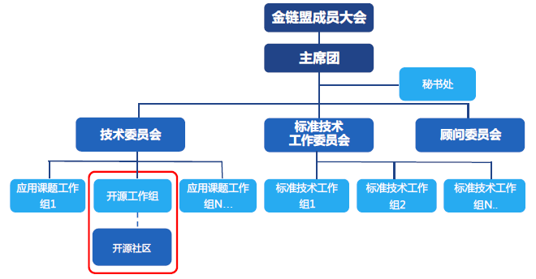
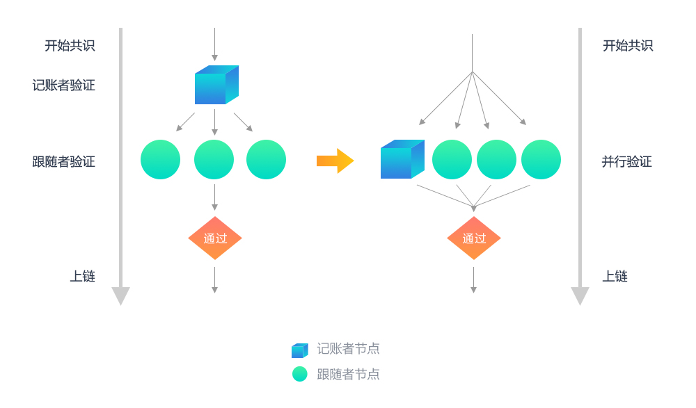
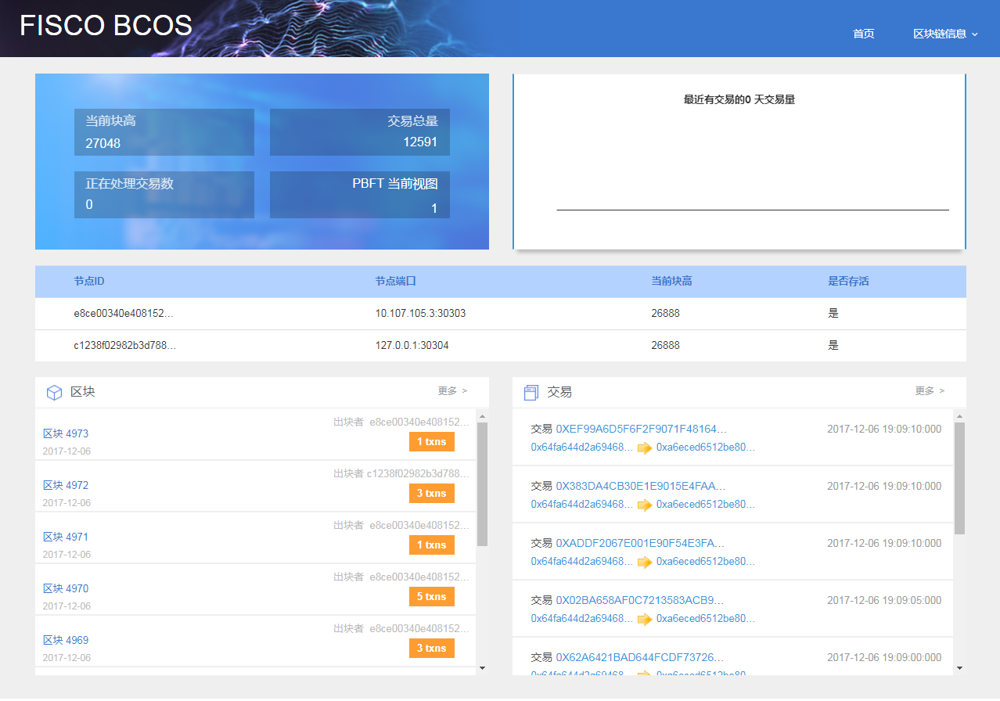
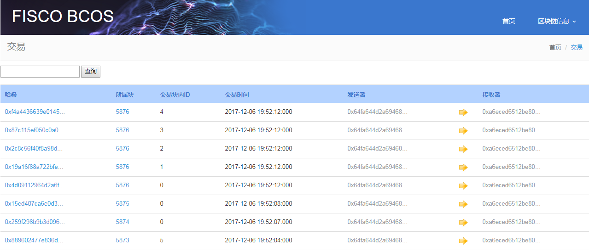

# 
**金融区块链底层平台FISCO BCOS白皮书**

## 
金融区块链基础设施与实践样本

### 
v1.0

####

### 
**Github**:[Https://github.com/fisco-bcos](Https://github.com/fisco-bcos)

### 
2017年12月

<!-- TOC -->

## 目录
- [前言](#前言)
- [一、缔盟：核心愿景与重点任务](#1-缔盟：核心愿景与重点任务)
    - [1.1 关于金链盟与金链盟开源工作组](#11-关于金链盟与金链盟开源工作组)
    - [1.2 金链盟开源工作组首批成员介绍](#12-金链盟开源工作组首批成员介绍)
    - [1.3 开源工作组的重点任务](#13-开源工作组的重点任务)
- [二、启示：实践痛点与解决方案](#2-启示：实践痛点与解决方案)
    - [2.1 传统金融行业的IT基础设施痛点](#21-传统金融行业的IT基础设施痛点)
    - [2.2 应对金融行业特殊需求的区块链解决方案](#22-应对金融行业特殊需求的区块链解决方案)
    - [2.3 “区块链+金融”的应用场景](#23-“区块链+金融”的应用场景)
- [三、升华：模块再造与功能重塑](#3-升华：模块再造与功能重塑)
    - [3.1 互操作性升华：基于区块链网络的消息通信协议（AMOP）](#31-互操作性升华：基于区块链网络的消息通信协议（AMOP）)
    - [3.2 运维能力升华：合约命名服务（CNS）](#32-运维能力升华：合约命名服务（CNS）)
    - [3.3 金融级的性能升华：并行共识与并行计算](#33-金融级的性能升华：并行共识与并行计算)
        - [3.3.1 并行PBFT共识](#331-并行PBFT共识)
        - [3.3.2 标准RAFT共识](#332-标准RAFT共识)
        - [3.3.3 并行计算和热点账户解决方案](#333-并行计算和热点账户解决方案)
    - [3.4 治理能力升华：浏览器与监控](#34-治理能力升华：浏览器与监控)
    - [3.5 区块链和监管科技](#35-金融级的性能升华：区块链和监管科技)
        - [3.5.1 风险数据整合](#351-风险数据整合)
        - [3.5.2 风险建模，分析和预测](#352-风险建模，分析和预测)
        - [3.5.3 实时交易监控，汇报和拦截](#353-实时交易监控，汇报和拦截)
        - [3.5.4 身份识别](#354-身份识别)
- [四、未来展望](#4-未来展望)
    - [4.1 国密算法改造](#41-国密算法改造)
    - [4.2 区块链云服务](#42-区块链云服务)
    - [4.3 支持多CA认证](#43-支持多CA认证)
    - [4.4 区块链数据仓库](#44-区块链数据仓库)
    - [4.5 开源运营](#45-开源运营)
- [参考文献](#参考文献)
- [关于我们](#关于我们)

<!-- /TOC -->

## 前言 

随着数字经济时代的开启与分布式商业模式的普及，区块链技术也得以发挥优势，成为前沿科技技术的代表。2016年，金链盟成员单位微众银行、Chinaledger成员单位上海万向区块链、矩阵元三家公司达成战略合作，共同致力于进行区块链技术的探索，且在2017年7月，三方将顺利完成的区块链底层平台BCOS（取BlockChain OpenSource涵义命名）完全开源，以便更多的开发者加入以共同完善技术，构建真正根植中国的区块链生态。

至今，BCOS平台距开源已经四个月有余，引起了行业良好的反响，越来越多的企业及个人开发者相继加入使用和共同完善。随着技术探索与场景应用的深入，在垂直领域尤其是金融领域，开始涌现出越来越多的新需求。

金融行业影响着资金和资本的配置，是关系国计民生的最重要行业。央行等监管机构已多次强调，金融创新不能偏离实体经济的需要，我们认识到金融业具有独特的外部性和公共性。因此，如何使BCOS平台满足金融行业的特殊要求，又不至于改变BCOS平台的行业普适性，成为正在使用BCOS平台的多家金融机构近期探索的焦点目标。

基于此目标，金融区块链合作联盟（深圳）（以下简称：金链盟）成立了开源工作组。该开源工作组旨在联合金链盟内的金融和科技机构，整合多方技术资源及人才，在BCOS平台的基础上，以金融业务实践为参考样本，深度定制一个安全可控的、适用于金融行业的开源区块链底层平台：FISCO BCOS。

本白皮书将对FISCO BCOS平台的实现进行展望，并以此作为未来进一步开发完善的开端。

## 一、缔盟：核心愿景与重点任务 

### 1.1 关于金链盟与金链盟开源工作组 

金链盟是由深圳市金融科技协会、深圳前海微众银行、深证通等二十余家金融机构和科技企业于2016年5月31日共同发起成立的非营利性组织。金链盟作为一个开放式组织，自愿遵守章程的金融机构及向金融机构提供科技服务的企业等均可申请加入。至今，金链盟成员已涵括银行、基金、证券、保险、地方股权交易所、科技公司等六大类行业的八十余家机构。

金链盟宗旨是整合及协调金融区块链技术研究资源，形成金融区块链技术研究和应用研究的合力与协调机制，提高成员单位在区块链技术领域的研发能力，探索、研发、实现适用于金融机构的金融联盟区块链，以及在此基础之上的应用场景。

为了深入探索定制一个自主可控的、适用于金融行业的开源区块链底层平台，金链盟于2017年11月在技术委员会下设开源工作组。开源工作组愿景是以开源技术为载体，促进成员合作，深化金融区块链推广工作，提供金融区块链技术培训，加强业内与国际开源组织合作及接轨，促进金融行业的区块链应用开发，并进一步支持金融区块链开源社区成立以发展更具多样性的区块链开源生态。

金链盟开源工作组隶属金链盟并遵守金链盟章程、法规、政策及其他有关规定，工作组成员均须为金链盟成员。

图1-1 金链盟的组织架构

### 1.2 金链盟开源工作组首批成员介绍 

金链盟开源工作组获得金链盟成员机构的广泛认可，并由部分专注于区块链底层技术研发的成员机构及开发者牵头开展工作。其中，首批成员包括以下单位（按企业名首字拼音字母排序）：

(1) 博彦科技------博彦科技股份有限公司（简称"博彦科技"，深交所上市公司，股票代码002649）是一家面向全球的IT咨询、解决方案与服务提供商。公司成立于1995年，总部位于中国北京，并在中国、美国、日本、印度、加拿大、新加坡等六个国家设有30余家分支机构、研发基地或交付中心。博彦科技依托自身强大的研发与创新能力，广泛采用基于大数据、云计算和移动互联等新兴技术，为高科技、互联网、金融、汽车、零售、物流、能源、制造、医疗、电信、媒体、旅游等行业客户提供丰富的解决方案及产品。

(2) 华为------华为是全球领先的信息与通信技术(ICT)解决方案供应商，专注于ICT领域，坚持稳健经营、持续创新、开放合作，在电信运营商、企业、终端和云计算等领域构筑了端到端的解决方案优势，目前，华为有17万多名员工，业务遍及全球170多个国家和地区，服务全世界三分之一以上的人口。

(3) 深证通------深圳证券通信有限公司（原深圳证券卫星通信有限公司）成立于一九九三年八月，是一家为证券市场提供数据通信服务的高科技企业，股东单位包括深圳证券交易所、中国空间技术研究院和中国卫星通信集团公司。自成立以来，积累了丰富的证券通信系统研发、建设、运行维护和管理经验，现已建成了覆盖全国、功能强大、安全高效的深圳证券通信网，肩负着深圳证券交易所、中国结算公司、证券公司、基金管理公司、商业银行及证券信息公司之间的证券发行、交易、开户、结算、行情发布、银证联网、多媒体信息传输等各种证券通信任务。

(4) 神州数码------神州数码融信软件有限公司是神州数码信息服务股份有限公司（简称：神州信息；股票代码：000555.SZ）旗下的专业软件服务公司，专注于金融行业，帮助银行规划、实施和管理IT系统，提供全面整合的金融IT服务。公司业务范围包括IT规划咨询、解决方案设计与实施、IT运营外包、软件开发与测试等，可为银行客户的商业战略、市场拓展、服务创新和绩效提升等提供最佳的IT支持。

(5) 四方精创------四方精创设立于2003年，是一家以大型商业银行为核心客户，致力于为中国大陆及港澳地区的银行提供专业IT服务外包的企业。公司业务类型包括软件开发服务（含IT咨询）、应用维护及系统集成。

(6) 腾讯------腾讯成立于1998年11月，是目前中国领先的互联网综合服务提供商之一。成立10多年以来，腾讯一直秉承"一切以用户价值为依归"的经营理念，为亿级海量用户提供稳定优质的各类服务，始终处于稳健发展的状态。2004年6月16日，腾讯控股有限公司在香港联交所主板公开上市（股票代号700）。

(7) 微众银行------腾讯牵头发起设立的、国内首家开业的互联网民营银行，国内金融区块链领域的先行者和奠基者，BCOS平台的主要开发者。

(8) 越秀金科------广州越秀金融科技有限公司为广州越秀金融控股集团有限公司（简称"越秀金科"）旗下第三家全资子公司，以银行核心业务系统为切入点，积极推进银行、证券、融资租赁、产投、担保、小贷信息系统建设，建立以信息科技公司为核心，贯穿越秀金控科技管理体系的独立信息科技平台。

### 1.3 开源工作组的重点任务 

金链盟开源工作组将专注于金链盟在推进金融区块链技术开源方面的事务及相关工作，作为金链盟与其他金融机构、科技企业、开源社区、监管机构、国际组织等在区块链开源领域的沟通合作桥梁。具体的重点工作任务，其一是打造并完善金融区块链开源平台------FISCO BCOS；其二是构建金融区块链开源社区，制定开源社区工作程序及管理制度，决策开源社区重大发展规划和方针，为社区重大事项提供指导与监督；最后是支持并协助开源社区工作，包括但不限于金融区块链的开源版本发布、技术培训、咨询、基础设施提供、运营推广等。

##二、启示：实践痛点与解决方案 

金融服务是区块链最早的应用领域之一。区块链技术带来安全可靠、简化流程、成本节约、降低操作风险以及增加信任等优点，具备重构升华原有金融业基础架构的潜力。金融业注重多方对等合作，以及具有强监管和高等级的安全要求，需要对节点准入、权限管理等作出要求，因此联盟链的技术方向成为金融业的主要选择。

### 2.1 传统金融行业的IT基础设施痛点 

当前我国金融业对外开放力度前所未有，金融创新步伐也在加速迈进，因此，如何有效平衡开放创新与风险防范的关系、牢牢守住不发生系统性风险的底线是业界迫切需要应对的挑战。

从金融IT基础设施的角度，仍存在一些操作风险、道德风险、信用风险、信息保护风险等方面的不足与痛点。

第一，金融IT系统数据仍存在被篡改、被伪造或一致性差异的可能。

第二，不同金融机构间的基础设施架构、业务流程各不相同，甚至仍涉及较多人工处理的环节，极大地增加了运营成本，也容易出现操作风险与道德风险。

第三，金融业务与金融合作或涉及多个参与方或中间方，容易提升信任成本与摩擦成本，也存在一定的互信、协作或合作对等性问题。

第四，金融业务往往复杂度较高，容易遗漏对业务全要素的记录，有时较难对业务全流程进行追溯，无法满足监管和审计需求。

第五，不同金融机构间的数据相对独立，难以实现安全高效的交互，导致进行重复的KYC、反洗钱、反欺诈的成本较高，也间接带来了用户数据被某些中介机构泄露的风险。

第六，集中式的IT基础架构的可用性与适应性较弱，需要采用分布式技术以提高健壮性或自适应性。

### 2.2 应对金融行业特殊需求的区块链解决方案 

区块链技术作为一种组合型的基础设施解决方案，原则上可以应对金融行业的需求。不过，由于金融行业的要求更加多样化与严格，作为金融版本的区块链解决方案，需要在普适行业的区块链技术基础上，根据金融机构特殊业务需求、现有技术水平以及法律法规等方面的要求或条件，从业务适当性、性能、安全、政策、技术可行性、运维与治理、成本等多个维度进行综合考虑。

第一，业务场景的适当性。并非所有的金融业务场景都需要采用区块链技术，一般而言，涉及到多方参与、对等合作的场景时，传统的集中式系统架构往往难以满足需求，则可考虑采用区块链技术，从而增加多方互信、提升业务运行效率、降低业务运营成本与摩擦成本。

第二，区块链系统的性能。金融业务往往具有海量交易、高频交易、及时确认等特征，因此金融行业的区块链开源平台，需要根据金融机构当前业务规模，分析区块链系统需要支撑的业务量、潜在业务增长规模、并发业务量、响应时间等技术性能指标需求。由于采用不同技术模块，例如不同共识机制的区块链平台对性能的支持存在较大差异，需要根据业务性能要求，结合区块链性能效率指标进行评估。

第三，区块链系统的安全性。区块链可以从技术层面保证记录数据的可信，防止数据被篡改、伪造等风险。此外在数据敏感性与安全性上，需要评估上链数据的内容加密强度，以及访问权限控制等。金融机构需要根据业务的具体安全要求，选择成熟、合适、安全的加密算法。

第四，政策合规性。区块链是一套技术解决方案，在合理设计的前提下，可以对现有的业务起到良好的支撑或对现有中心化系统进行很好的补充。但金融机构在使用区块链开展业务的过程中，必须在国家现有的监管要求与法律框架内施行。

第五，技术可行性。区块链技术已经在部分金融场景中落地，但目前还属于一项新兴技术，需要充分评估该技术与具体业务的契合度、及其与传统系统相比的优劣势后，最终选择合适的区块链平台进行论证与试运行。

第六，运维与治理能力。由于基于区块链的业务与传统中心化系统在运营和管理上存在差异，而金融业务的持续治理要求极高，需要进行相应的规划与调整，评估新的治理结构的可行性、可持续性，评估版本迭代与系统正式上线的影响程度，实时监控区块链系统的运行，确保业务可控与金融环境稳定。

第七，成本可控与经济可行。区块链应用通过技术特点来解决实际业务中的特定问题，有效解决痛点问题的应用可以为金融业务带来极大的收益，应用本身的价值也能得以显现；相反如果不能解决行业的重要问题，则需面临成本与收益的权衡取舍。

### 2.3 "区块链+金融"的应用场景 

如能针对金融行业的特殊需求，打造一套安全可靠的金融区块链底层平台，则区块链技术在金融行业将大有用武之地。

举例而言，从银行机构的角度看，重点探索方向一般是应用区块链技术降低清算结算成本、提高中后台运营效率、提升流程自动化程度与降低经营成本等。此外，在跨境金融场景中，区块链有助于实现跨境金融机构间的账本共享，降低合作银行之间的对账与清结算成本以及争议摩擦成本，从而提高跨境业务的处理速度及效率。

从非银金融机构的角度看，区块链可用于提升权益登记、信息存证的权威性、削减交易对手方风险、解决数据追踪与信息防伪问题、降低审核审计的操作成本等。

从金融监管机构的角度看，区块链为监管机构提供了一致且易于审计的数据，通过对机构间区块链的数据分析，能够比传统审计流程更快更精确地监管金融业务。例如，在反洗钱场景中，每个账号的余额和交易记录都是可追踪的，任意一笔交易的任何一个环节都不会脱离监管的视线，这将极大地加强反洗钱的力度。

## 三、升华：模块再造与功能重塑 

基于在金融行业的实践积累，以及对金融区块链解决方案的思考，金链盟开源工作组在BCOS开源平台的基础上，根据场景需求，进行模块升级与功能重塑，打磨FISCO BCOS开源平台，赋予其更好地服务金融机构的新功能、新特性与新能力。

### 3.1 互操作性升华：基于区块链网络的消息通信协议（AMOP） 

基于区块链体系，机构之间可以建立一个互相通信的网络。区块链的共识机制、区块数据交换已经可以承载机构之间交易往来，但随着业务场景的逐渐丰富，对"互操作性"也提出了更多要求。

机构和机构之间不仅有面向交易的事务性过程，还可能会向另一个机构发出实时通知，或者传递仅为两个机构之间共享的数据，或者在交易达成之前对定价等细节进行多次交互性协商，在这些流程中，机构们并不希望向整个网络广播数据，其部分数据最终也不一定需要写入链上交易。此前，机构之间通常有专线和特有的接口机来建立通信，如今在区块链已经建立了一个稳定高效网络的前提下，我们可以复用区块链网络的链路来完成通信。

所以，我们设计了一个高效、可靠的、基于区块链网络的消息通信协议，简称链上信使协议AMOP（Advanced Messenger On-chain Protocol）,聚焦以下功能：

-   基于区块链网络，支持跨行之间、点对点的实时消息通信；

-   为链下系统和区块链之间的交互提供标准化接口；

-   区块链系统可主动调用链下系统的业务接口；

这个协议的技术特点是：

-   在点对点的区块链网络拓扑中，规划节点通信路径，确保消息可达；

-   可快速感知区块链网络的节点异常，自动切换路径重发消息；

-   在通信过程中使用加密技术，保证通信层隐私。

图3-1 AMOP架构

AMOP协议在金融机构之间的业务来往中可以提供灵活的互操作性，可以结合区块链来实现复杂的交易场景。考虑以下的场景：

A机构和B机构之间进行某种商品交易的价格协商或者份额撮合，其间需要往复多次协商，最终双方商定结果后，再按此结果发起链上交易，写入账本并达成确认。

在前期的往复协商撮合过程中，对实时性的要求较高，如毫秒级的响应速度，且过程并不需要链上其他机构参与或让其他机构得知细节，那么可以采用AMOP协议来进行点对点的保密通信，AMOP协议保证通信包并不会传递给其他机构的节点，物理上进行了隔离。

或者，当一个企业发起一个订单交易到链上，希望另一个企业快速跟进，进行链下审核、备货等等，可以通过AMOP协议，给对方一个通知消息，以启动并完成链下的各种工作，然后再到链上继续完成订单的后续流程，如付款等。

另外，在区块链和区块链之间的跨链通信环节，也可以引入AMOP做为消息通道，打通链和链之间的通信，交换区块和交易数据等。

### 3.2 运维能力升华：合约命名服务（CNS）

目前区块链的用户、帐户、智能合约等基本信息，在链上的体现为一个"地址"（Address），地址通常为一些固定长度的十六进制的数据标识，业务层需要使用这些地址时，会把地址通过数据库、配置文件等方式记录下来以便调用。这些数字型地址的问题在于：难以辨识其类型和对应的数据实例，难以记忆、书写、复用。

比如，业务层需要调用某个账目合约，那么需要配置一个类似这样的地址"0x92535066cd4b022c7e84b058d8bbbf71e22c3c78"，在日常运维、运营配置中，需要再用到这个账目合约时，就得确认这一段数字的完整性、正确性，才能正确调用这个地址上的合约接口，或者在运维查证过程中，根据这个地址去查询日志里的对应信息，或者在进行服务扩容时，在配置文件里去配置这一个地址。

另外，在这个账目合约因为业务逻辑的变化而被重新升级部署后，需要逐一去修改之前已经引用这个合约地址的所有业务模块，以指向新的合约的地址，整个过程繁琐且容易错漏。

因此，我们设计了合约命名服务CNS(Contract Name Service)。CNS的设计目标，是使业务层和智能合约之间的对应关系命名化，让业务层不再关心相关的合约地址。类似DNS之于互联网，域名的使用让用户更容易记住网站的访问方式，也让网站在集群化、迁移扩容方面都获得了巨大的灵活性。CNS的设计灵感也是来自互联网，且加强了对合约接口的信息管理，使合约可以将自己的接口信息在链上发布出去，让链上的所有参与者都可以方便的识别、定位、调用合约。

在智能合约部署时，CNS允许合约部署者给智能合约指定一个容易记忆和辨识的名字，如"DepositContract"，显而易见这是一个存款合约。业务层只需知道这个名字，就可以向存款合约发起交易，CNS会在处理交易之前确认名字对应的合约地址，并运行合约。

当存款合约被升级时，新版本合约的地址也会更新到CNS，只要原有的接口没有改变，则业务层不需要更改配置，基本上是无感知的持续运行即可，这样节约了大量的运维更迭的工作量，也使此过程出错的机率大大较少。

如果接口或者有重大的业务逻辑改变，业务需要灰度升级，在CNS里也可以保存新旧合约的两个地址，根据具体的灰度方案，由业务层指定，或者由CNS再结合路由规则的实现，将部分交易流量切换到新合约，待新合约的逻辑已经足够稳定，或者灰度放量达到100%，再将对旧合约的调用全部切换到新合约。

需要一提的是，业务灰度是个复杂的过程，不同的业务的灰度规则是不同的，CNS在平台层面提供了基础能力，如何灵活运用，需要按场景去进行分析和使用，如灰度升级时的路由寻址规则如何实现，平台将决定权交给实际使用的用户，由用户自主扩展。

### 3.3 金融级的性能升华：并行共识与并行计算 

#### 3.3.1 并行PBFT共识 

BCOS的PBFT共识机制已经针对联盟链的进行了定制，实现秒级出块，具备高一致性、高可用性，抗欺诈能力较强。

PBFT算法的过程是一次提案，几步投票直到最终确认，在这个过程中有复杂的状态机维护过程，投票往返步骤较多，且部分流程在节点内部以及节点之间是串行进行的，每一步都会需要互相等待，在其他上一阶段的计算完毕或网络通信收集数据完成，达成阶段性确认后再进入下一阶段。

由于流程复杂，数据往返较多，共识过程也容易受网络波动影响，对网路延迟和丢包比较敏感，在状况不理想的网络和计算环境可能需要多次共识的尝试才能达到最终一致性。

以上的技术挑战给系统带来的影响是，系统并行能力可能遇到瓶颈，或者交易的确认速度会偶发性延长。所以我们对PBFT算法进行了深度的优化。

在FISCO BCOS平台中，首先我们对共识过程进行了深入分析，按计算步骤，节点等维度进行分解，尽量让所有的节点在每个阶段的计算都是并行进行的，无论是议长节点还是投票节点，一个节点在运算验证一批交易的过程中，其他所有节点也在同步运算和给出投票，不需要互相等待。

图3-2 并行PBFT共识流程

然后，我们对耗时较高，有次数冗余的计算过程进行了精简，通过关键路径优化，重复计算结果进行缓存等方式减少了共识过程中的每一步的耗时。

同时，我们对网络健康度、节点存活等因素进行检测，当发现有的记账节点无法服务时，快速切换到下一个记账节点，避免出现全体节点出现空等待的状况。

最后，我们考虑到金融交易的场景常常有高峰期和空闲期的特点，在空闲期系统没有交易流量的时候，共识机制进入心跳状态，只维护网络的健康状态，不产生包含交易数为0的空区块数据，避免不必要的存储浪费，以及避免空区块的同步流量和时间消耗。

#### 3.3.2标准RAFT共识 

BCOS原有的RAFT共识算法实现借鉴了RAFT协议的思想，同时也有别于标准RAFT协议，如各个节点通过竞争时间窗获取每一次出块的权利。

考虑到RAFT协议设计本身无法防止拜占庭错误，其应用通常是信任度较高的联盟链场景，我们为了让RAFT协议发挥其高性能的优势，在FISCO BCOS平台中对RAFT共识算法做了调整，采用标准RAFT协议的共识算法。

标准RAFT共识算法分为两个过程，第一个是"选举"过程，选举产生一个Leader；第二个是"记账"过程，Leader负责记账出块，Follower节点同步区块。当Leader宕机时，所有Follower节点触发"选举"流程，重新选出一个Leader。

图3-3 标准RAFT共识流程

相比RAFT论文提及的算法，我们还针对网络抖动、网络延迟以及网络分区孤岛异常情况进行一系列优化，使RAFT共识算法能够满足更极端的网络环境。该RAFT算法具有N/2的容错能力，只要一半以上节点就可以正常服务。

为了使联盟链网络具有更高的扩展性，RAFT共识算法结合智能合约支持节点动态增加和退出网络，这也是该RAFT算法的一大亮点。

#### 3.3.3 并行计算和热点账户解决方案 

在研究和实现区块链平台和进行业务落地的过程中，区块链的运行速度往往会受多种因素影响，其中包括加密解密计算、交易广播和排序、共识算法多阶段提交的协作开销、虚拟机执行速度等，以及CPU核数主频、磁盘IO、网络带宽等。由于区块链先天是跨网络的分布式协作系统，注重安全性、可用性、容错性、一致性、事务性等，需要使用较复杂的算法和繁琐的多参与方协作机制来获得基于系统的自信任性、数据不可篡改性以及交易可追溯性等特殊功能优势，因此根据分布式的CAP原理，在同等的硬件资源投入的前提下，区块链的性能往往低于中心化的系统，其表现就是并发数不高，交易时延较明显。

我们已经在多个方面对系统运行的全流程进行细致的优化，包括加密解密计算、交易处理流程、共识算法、存储优化等，使我们的区块链平台在单链架构时，运行速度达到了一个较高的性能水准，基本能满足一般的金融业务要求。

不过，在面对用户数、交易量、存量数据较大或可能有显著增长的海量服务场景时，单链架构总是会遇到软件架构或硬件资源方面的瓶颈，难以满足高频海量的金融业务所需的容量和扩展性要求。

况且，区块链的系统特性决定，在区块链中增加节点，只会增强系统的容错性、增加参与者的授信背书等，而不会增加性能。增加节点并不能解决问题，这就需要通过架构上的调整来应对性能挑战，所以，我们提出了"并行计算，多链运行"的方案。

并行多链的架构基本思路是在一个区块链网络里，存在多个分组，每个组是一个完整的区块链网络，有独立的软件模块、硬件资源，可独立完成机构间共识，有独立的数据存储。

根据可定制的路由规则，参与到区块链网络的所有机构和用户，或者区块链里不同类型的交易，都可以接入到不同的分组里。每个分组处理特定的一部分交易，当机构或用户数增加，交易量变大或者交易类型增加，都可以快捷地增加分组，并在路由策略里进行设定，将新增的流量分配到新的分组里。并行多链架构类似数据库的分库分表，或者互联网服务的分SET模型，理论上只要投入足够的资源，则系统能处理的流量没有上限，整个系统具有足够的弹性。

同时，一个区块链网络里的多个分组秉承逻辑和配置高一致性的原则，在商业规则、运营管理上都使用统一的策略。比如，每个分组上的智能合约是完全相同的，核心配置数据也是相同的，只有分组里的机构、用户以及交易类型有所不同。

或者，虽然因为分组间功能设计的差异，导致不同分组上的智能合约有所不同。如一些分组是处理用户在线交易，强调低时延性；另一些分组是处理机构间的对账和清结算，关注批量数据处理。那么部署在这些分组上的智能合约会有所不同，但都会通过所有机构以及区块链的运营委员会共同确认，通过共识算法保证部署实施的一致性、透明度以及不可篡改性。

总之，平台提供了基础的分组策略和实现、路由模块、并行多链的构建工具等，如何根据业务场景设计不同的分组，如根据机构维度、用户维度还是交易维度，甚至是时间维度等，都可以再进行灵活的设计和操作。

图3-4 并行计算多链架构

在实现了区块链分组后，分组之间有可能出现互相发生交易的场景，实际上就是不同区块链系统之间的通信和交易，类似"跨链"的架构。在这个环节，需要关注的是分组间的通信可靠性、分布式事务完整性和一致性，以及分组之间可验证、不可篡改、可追溯的互信性和交易安全性。

图3-5 并行计算跨链交互

在此版本中，我们还根据金融业常见的"热点帐户"场景，提出了一种解决方案。

在很多金融交易场景里，可能会出现大量的独立用户帐户和少数集中的一个或多个热点帐户产生交易的情况，如用户往某个热卖中的商户付款，或者用户频繁从某个帐户中提现或者获取优惠券、积分或者其他资产等，由于用户帐户数量较大,相对来说，这些被集中访问的商户帐户，就被称为"热点帐户"。热点帐户在完成和用户的交易之外，还需要汇总所有的交易结果，计算总分帐、余额等，以便完成其特有的商业流程，如清结算等。

图3-6 热点账户架构

由于针对热点账户的交易量较大且所有用户都可能和它发生交易，我们考虑设计多个并行的交易链，首先将用户按照一定的性能模型分组，每个针对用户的分组而构建的独立的区块链组件，我们称为"用户交易链"。举例：预估为每个分组100万用户，5个分组能容纳500万用户（实际的每组能容纳的用户数需要根据业务场景实测评估），这样我们构建了5个"用户交易链"。

然后，热点帐户本身可以集中在一个热点账户的链上（也可以分配在某一个分组里），热点账户链主要用于准实时的汇总各"用户交易链"的账务，以管理热点账户的总分帐，如总收入、总支出、帐户准实时余额等。

为了支持用户和热点账户的交易，热点帐户在每个"用户交易链"上，都会设立一个影子户，用户在实时交易时，实际上是和"用户交易链"内的热点帐户影子户发生交易，每次交易都在用户交易链内部进行共识，不同的分组可以并行进行交易计算，互不相关，用户和影子户之间的交易完成后，即意味着用户和热点帐户的交易完成。系统的容量和用户交易链的个数有关，用户交易链越多，则系统容量越大，用户体验得到了保障。

在用户交易链上，热点帐户影子户里只保存该分组里的总分帐，即一部分用户进行交易后，影子户里产生的收入、支出等。用户交易链会定期构建一次链内账目清算交易，并向热点帐户链发起一次跨链汇总交易，热点帐户链接收到交易之后，会到用户交易链去验证交易发送者的身份、汇总交易的存在性、账目的真实性和准确性，验证成功后，在热点帐户链上继续进行账目计算和入账操作，流程结束。

整个过程会通过链间的中继，进行多次双向通信，且在不同的链上完整的执行共识确认。用户和影子户的交易可在一次共识的时间段内完成，时延较短，以满足用户体验。热点账户的总分帐计算为准实时完成，其时延取决于定时发起汇总交易的间隔，以及用户交易链和热点帐户链的共识时间。系统会保证用户交易链和热点帐户链之间的交易不错、不乱、不漏，具备事务一致性和完整性。

并行多链计算是一个基础的系统扩展方案，热点帐户的解决方案是一个场景性的实现，充分理解并行多链计算和跨链交易的实现后，可以针对有海量需求的各种金融交易场景，设计出不同的方案来，以解决具体的场景问题。

### 3.4 治理能力升华：浏览器与监控 

在联盟链治理过程中，如何清晰、便捷地监控联盟链运行状况，并支持监管和审计诉求，是我们始终关注的问题。为满足金融行业对数据结构化、可视化、可监管、可审计的要求，我们在区块链浏览器、监控体系方面，进行了重点研究。

首先，我们提供了区块链浏览器，将区块链上的数据可视化，并进行实时的展示；用户即使毫无技术背景，也可以通过web页面，方便地获取其所部署的区块链上的节点、区块和交易信息，同时查看历史的交易曲线，省去从区块链节点的RPC端口查询的繁琐操作。

图3-7 区块链浏览器总览

目前，用户通过浏览器可以实时获取的信息包括：

-   节点的ID、端口、块高等信息；

-   区块的块高、时间、交易数量、出块者等信息；

-   交易的HASH、所属块、块内ID、交易时间、发送者、接收者等信息；同时，用户也可以获取到正在处理的交易信息。

图3-8 交易信息

使用区块链浏览器非常简单、便捷,只需对开源代码进行编译、准备数据库和web服务部署，即可快速打开区块链浏览器界面。同时，我们提供灵活的UI框架，开发者可以对浏览器界面进行定制，从而支持个性化或特定的应用场景。

另外，我们还优化了监控统计日志，使开发者可以快速获取区块链系统运行过程中的重要指标，从多个维度对系统运行状况进行评估。我们提供了数据库、共识算法、交易和区块四个维度的时间统计日志；同时，开发者也可以通过PBFT Flow的日志来了解每个区块从开始打包到最后上链的时间过程；或通过Transaction Flow的日志来了解每个区块从进入交易队列到最后上链的时间过程。

### 3.5 区块链和监管科技

随着金融科技的高速发展，新型业务的监管和合规也成为了金融业的焦点，如何采用科技手段来高效和精准地解决监管问题，推动企业遵循合规要求，对监管科技提出了更多的要求。FISCO BCOS在数据整合分析、交易管控、身份认证等方面进行深入探索，从而满足金融行业对于监管、风控等方面的高标准要求。

#### 3.5.1 风险数据整合

基于区块链上不可篡改、可追溯、分布式高一致性的数据，可以给与监管机构充分和透明的信息，交易参与方、交易明细、交易过程以及交易历史记录，都记录在区块链账本上，可以做到海量历史数据的完整妥善保存，且解决数据孤岛问题，满足风险数据结构化、明确、准确、完整的要求。

#### 3.5.2 风险建模，分析和预测 

将区块链上完成的数据与大数据挖掘、机器学习等技术进行有机结合，再整合市场数据，行业数据，可以制定更准确的风险模型，提高风险预测能力，满足机构全面风险管理的要求。

#### 3.5.3 实时交易监控，汇报和拦截

交易监控系统可以获取区块链上准实时的、高完整性和确定性的交易数据，有助于及时发现风险。

FISCO BCOS平台内置权限控制、系统治理控制，再结合图灵完备的智能合约及其强大的可编程性，可预置多种检测和拦截规则，如内置反洗钱黑名单以及检测规则，当发现异常交易时，及时发出告警，或者直接进行拦截，可允许监管方实时介入到交易过程中。

#### 3.5.4 身份识别 

区块链本身实现了高效的数字身份认证机制，接入到区块链系统的各种角色身份会经过审核，并通过唯一的公私钥对，或者CA证书进行标识，使得所有链上所有人的身份是可辨识且不可抵赖的。

结合金融业成熟的KYC制度，依靠客户审查尽调的结果数据，生物识别技术，以及客户信用数据等，可以为客户验身且在区块链上分配唯一的身份标识，如有需要，可采用信息脱敏流程、或密码学算法进行KYC信息的隐私保护，保证客户在链上具有确定且合法的身份，但敏感信息不会泄漏，同时监管方又可以获得足够的信息进行管控。

## 四、未来展望

回顾IT产业的发展历程，开源技术起到无与伦比的重大贡献作用。围绕开源技术形成开源组织或开源社区，可促进商业机构、科研机构、监管机构、教育机构、开发者、用户等相互之间的良性沟通、共享与协作氛围。在某种意义上，开源组织或开源社区也是互联网经济、共享经济、数字经济等新经济的基石。

金链盟开源工作组以打造一个适用于金融机构的区块链底层平台FISCO BCOS为契机，将凝聚同时熟悉金融行业业务逻辑和区块链技术实现的企业机构和开发者，开发技术人员不仅可在Github上参与FISCO BCOS开源项目，更可建立金融区块链的生态圈，促成开放的分布式技术协作模式，共同探索金融区块链的分布式商业应用。

FISCO BCOS平台计划在后续版本中逐步推出以下关键特性及开源活动，并和BCOS平台相互之间保持同步，整合更多有价值的功能，成为完备的金融业务基础设施。

### 4.1 国密算法改造

金融业务的交易数据具备高敏感度，甚至关系到金融体系安全。国密算法自主可控，不依赖于国外的技术，能极高程度地保护信息安全。

我们计划采用SM（公私钥密码算法，可实现数字签名），SM3（摘要算法），SM4（对称密码算法）等几个国密算法，对区块链平台里牵涉到密码的模块全面进行改造升级，所涵盖的模块包括身份认证、通信加密、存储加密、唯一性标识和数据签名验签等。基于国密算法，可保证身份认证的准确性和可信性、交易行为的不可否认性、数据有效性、数据完整性和不可篡改性，以及进行隐私保护。

同时，我们也将引入基于国密的硬件加密机制，包括USBkey、加密机、智能卡等，以满足各种金融场景需求。

### 4.2 区块链云服务

区块链云服务技术提供了规模化的、合规的、安全的区块链技术相关的基础软硬件平台，在服务层面对区块链的功能进行封装，提供标准简单的开发接口，在基础设施层面通过金融云平台的支持，支持快速交付和软硬件升级，易于运营和运维，使金融业务开发者可以专注在自己的业务领域，并基于区块链技术，快速和安全地推出可面向市场运营的业务、采购、开发、运维成本都会大幅降低。

我们将基于FISCO BCOS版本，在云平台发布区块链云服务器镜像，使用云平台界面交互和其他工具，可快速构建区块链服务，进行应用部署和服务器参数调整。在服务运行期，可对区块链服务进行立体监控，保证其健壮性和可用性。

出于金融业务对安全性和合规性的要求，推荐使用金融云机房部署区块链服务。金融云方案可提供专有物理隔离、独立网络核心的合规IDC，支持统一管控，以及高强度的安全防护能力，能满足金融级区块链服务既要共享数据互联互通，又需要保护隐私和交易安全的苛刻要求。

### 4.3 支持多CA认证

FISCO BCOS平台已经使用CA证书作为机构认证，节点准入的重要判定手段。具备资质的CA中心作为可信第三方，颁发CA证书为机构背书，有效的形成保障信息机密性、完整性、抗抵赖的解决方案。

同时，诸多的CA中心所在地域或面向行业有所不同，所颁发的CA证书的互通性会被信任体系和服务协议影响，不同CA机构颁发的证书在数据机构、安全协议、有效性和安全等级上都有所不同。另外，有如区块链这样的分布式系统只依赖于单一CA服务机构，可能出现单点问题，影响了可用性。

所以，我们在平台架构上提出一个面向CA的抽象实现层，便于接入不同的CA机构证书，这个抽象层关注CA证书使用环节的兼容性、可用性、规范性、安全性。通过多CA抽象层的封装和接入，不同的CA机构都可以为区块链上的机构、节点、交易员等身份给出统一视图的信用背书，如有必要，一个链上机构可以同时采用多个CA机构的证书。形成一种"多中心"认证的形态，可提升区块链系统的信用等级，改善机构体验，增强系统可用性。

### 4.4 区块链数据仓库

FISCO BCOS核心数据模块采用链式数据结构，Key-Value数据元格式，使用高速的文件数据库保存所有数据，适合存储区块和交易明细、合约状态等，但不适合进行关系型查询、动态范围查询，不能直接进行多维度的分析。

所以，我们计划输出一个"区块链数据仓库"的解决方案，使区块链和已经为人熟知的关系型数据，分布式数据库，大数据平台进行有机结合。

为区块链设置一个准实时的数据ETL（Extract-Transform-Load）流程，使得链上一旦新生成区块，就能立刻把相关的区块证明，区块里包含的交易列表、交易明细、交易结果、智能合约状态数据、链上配置信息等全部导入到链外的数据仓库里，数据仓库的数据只增不减，写入后不会再发生变化，且随时可以和链上数据源进行比对验证，保证其完整性和不可篡改性，借助数据仓库本身强大的查询能力、分析能力和数据挖掘能力，可以对区块链上产生的数据进行复杂的整合和加工，以满足商业智能、监管监控、反洗钱、数据报送等场景的需求。

### 4.5 开源运营

在不断进行金融区块链技术探索的同时，开源工作组还将积极运营开源，推广FISCO BCOS:

-   通过优化部署工具、丰富样例、完善技术知识库等方式，降低开发者学习和使用门槛，引导开发者快速入门金融区块链技术，使社区更加活跃、技术更加成熟。

-   在全国各大城市，组织不同主题且面向不同对象的开发者活动，鼓励更多有志于区块链技术的开发者或单位参与FISCO BCOS的技术优化或应用探索。目前在计划中的活动包括：面向FISCO BCOS开发者的编程马拉松，以及鼓励开发者和企业单位共同参与的FISCO BCOS应用大赛等。以上活动计划分时间段、分城市逐步展开，使国内外开发者和企业都可以参与到FISCO BCOS开源社区中。

-   制定入门、中阶、高阶等不同层级的培训课程，邀请行业专家与FISCO BCOS开发团队一起，通过在线课程和线下讲座等方式为开发者提供培训。开发者参与自己感兴趣培训的同时，还可以进行培训认证。开源工作组会制定区块链底层技术、应用等不同类别的认证体系和标准，方便开发者不断了解自身的能力层级和学习需求，逐步成长为行业专家。

另外，开源工作组欢迎业界同仁共同探索和孵化金融区块链领域的分布式商业应用。对于使用FISCO BCOS进行应用探索的企业单位，工作组会提供专业的企业级的区块链解决方案及培训、咨询服务。

展望未来，金链盟开源工作组将整合愈来愈多的金链盟成员单位的技术资源与商业力量，缔造一个深度互信的金融区块链价值共同体，欢迎加入共同探索！

## 参考文献

\[1\]《BCOS平台白皮书 V1.0------面向分布式商业的区块链基础设施》，2017年7月，微众银行、万向区块链、矩阵元

\[2\]《In Search of an Understandable Consensus Algorithm (Extended Version)》，2013年，Diego Ongaro and John Ousterhout

\[3\]《Practical Byzantine Fault Tolerance》，1999年，Miguel Castro and Barbara Liskov

## 关于我们

金链盟全称金融区块链合作联盟（深圳），是由深圳市金融科技协会、深圳前海微众银行、深证通等二十余家金融机构和科技企业于2016年5月31日共同发起成立的非营利性组织。金链盟作为一个开放式组织，自愿遵守章程的金融机构及向金融机构提供科技服务的企业等均可申请加入。至今，金链盟成员已涵括银行、基金、证券、保险、地方股权交易所、科技公司等六大类行业的八十余家机构。

金链盟区块链底层开源平台（FISCO BCOS），由金链盟开源工作组协作打造。工作组成员包括博彦科技、华为、深证通、神州数码、四方精创、腾讯、微众银行和越秀金科等金链盟成员机构，旨在打造安全可控、适用于金融领域的区块链底层平台。

您可以通过以下方式，进一步了解FISCO BCOS及金链盟的相关信息：

-   源码地址：[https://github.com/fisco-bcos](https://github.com/fisco-bcos)

-   联系邮箱：<service@fisco.com.cn>

-   金链盟官网：[www.fisco.com.cn](http://www.fisco.com.cn)
